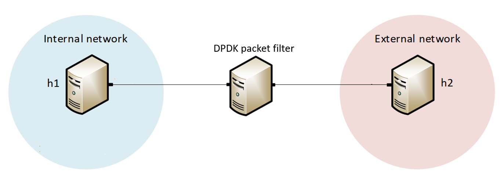

# Project Title  
## DPDK Packet Filter  
A high-performance packet filtering system for controlling and securing traffic between an internal network and an external network.

---

## Group Info  
- Sergio Elizalde  
  - Email: elizalds@email.sc.edu
- Samia Choueiri  
  - Email: choueiri@email.sc.edu 
- Amith GSPN  
  - Email: amithgspn@sc.edu 

## 1. Overview

This project implements a packet filter designed to regulate and secure traffic traversing between an **internal network** and an **external network**. The system ensures:

- ✔️ **Internal devices can freely initiate outbound connections**  
- ✔️ **Unsolicited or unauthorized inbound traffic from external sources is blocked**  
- ✔️ **Reduced attack surface for internal hosts**  
- ✔️ **High-performance packet processing using DPDK**

The goal is to provide an efficient, minimal-latency security layer that protects internal resources from external threats while allowing legitimate outbound communication.

---

## 2. System Architecture

The filtering logic relies on a DPDK pipeline that inspects packet headers, maintains connection state, and enforces directional security rules.

Below is the network topology used by the system:

  

**Key behavior:**

- Outbound traffic initiated from the internal network is allowed.
- Only packets belonging to **established** outbound sessions are permitted inbound.
- Any unsolicited packets originating externally are dropped.

---

## 3. Repository Structure
.
├── include/           # Header files for filter logic
├── src/               # Main DPDK application source code
├── scripts/           # Setup, build, and execution scripts
├── threat-model/      # Documentation of security analysis and assumptions
├── figs/              # Figures used in documentation/presentations (topology, diagrams, etc.)
├── Report.ipynb       # Main report & notebook for running/testing the system
├── Presentation.pptx  # Project presentation
└── README.md          # This file

